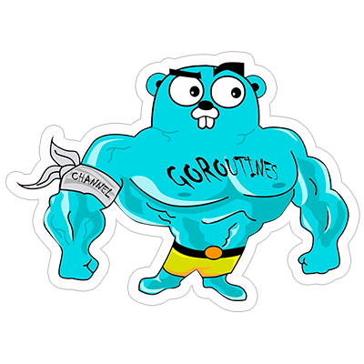

# RabbitMQ Test case

## Task description

МикросервисА генерит 2 события (событие это JSON) и кладет их в очередь.

МикросервисB (инстанс 1) получает 1 событие и обрабатывает.

МикросервисB (инстанс 2) получает 2 событие и обрабатывает.

МикросервисB может отправить Ack, Nack, Reject с параметром requeue=true/false, а также может сгенерировать сообщение и также положить в очередь.

Нужно реализовать клиента к RabbitMQ с общим интерфейсом (без привязки к RabbitMQ, есть например еще ActiveMQ) со всеми методами которые нужны для реализации логики описанной выше.

## Example ENV
```
BROKER_DRIVER=rabbitmq
BROKER_HOST=localhost
BROKER_PORT=5672
BROKER_USERNAME=guest
BROKER_PASSWORD=guest
```

## Solution notes
+ 🔱 clean architecture
+ ✅ tests

## HOWTO
+ run with `make run`
+ run client with `make run_client`
+ run server with `make run_server`
+ run test with `make test`
+ run test coverage with `make test_coverage`